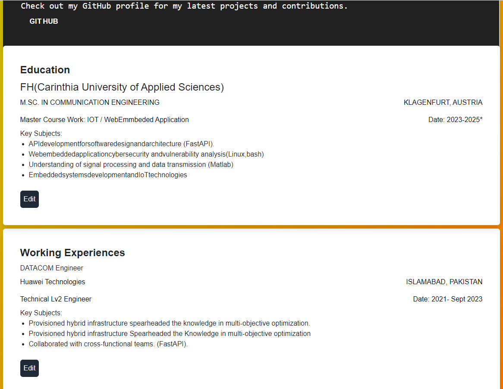
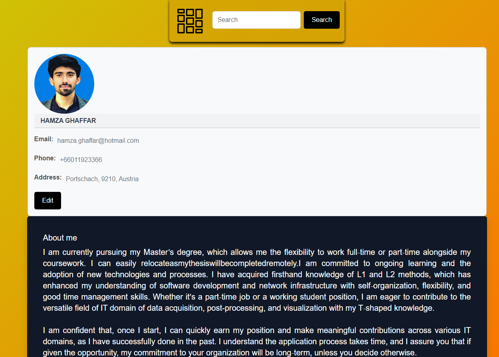
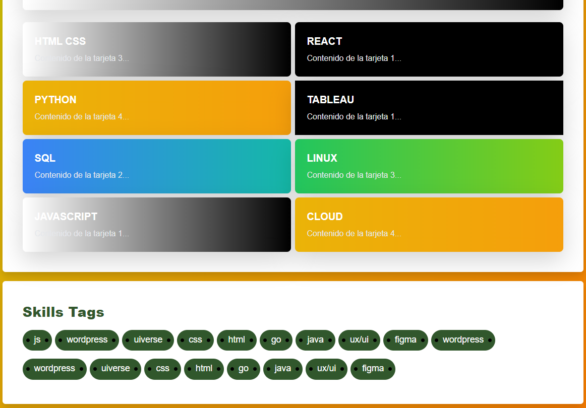
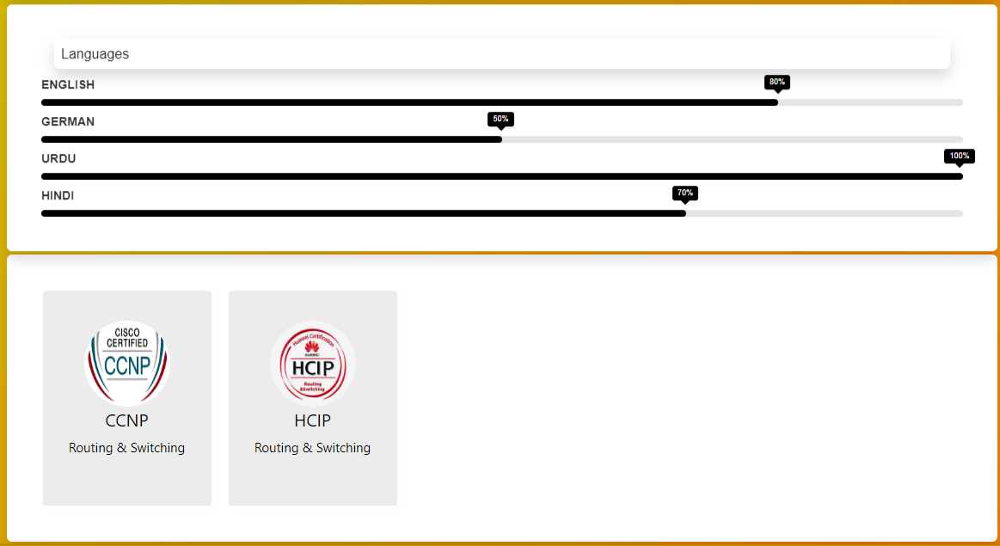

# Resume in React v1.0

This is a static template for a resume built using React.

![React Resume]

()

## Features

- Displays information about the user's
- Includes social media links for each certification.
- Clean and simple design.

## Installation

1. Clone the repository: `git clone https://github.com/Hamza-Ghaffar/Resume_In_React_v1.0.git`
2. Navigate to the project directory: `cd Resume_In_React_v1.0`
3. Install dependencies: `npm install`

## Usage

1. Start the development server: `npm run dev`
2. Open your browser and go to `http://localhost:"e.g"`

## Credits

This project is created and maintained by Hamza Ghaffar.

Special Thanks:

- My younger brother
- OpenAI
- My teachers
- My fellows

## License

This project license free for education purposes its small task but save your time !
